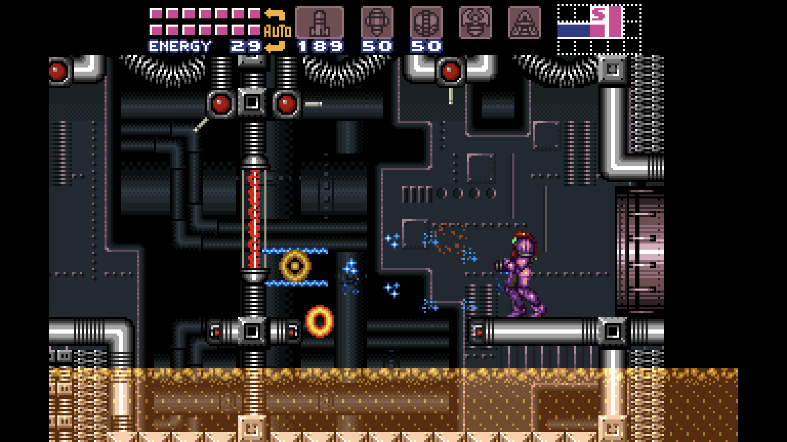
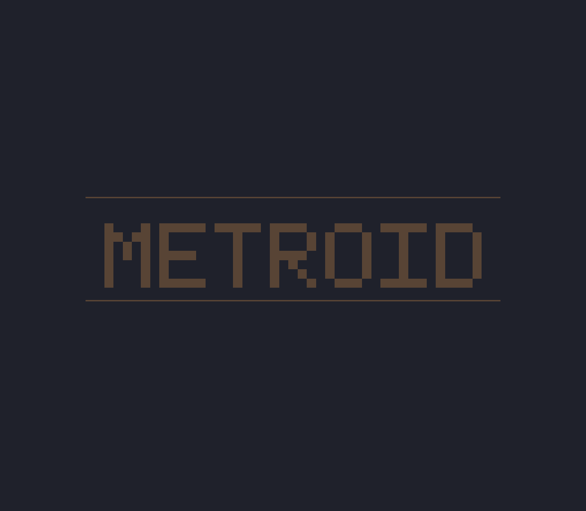
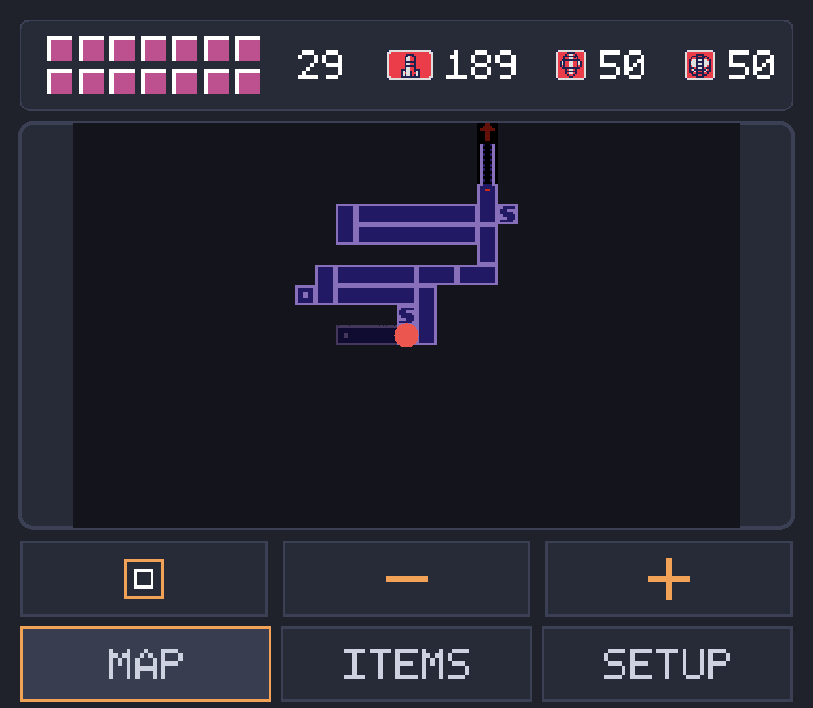
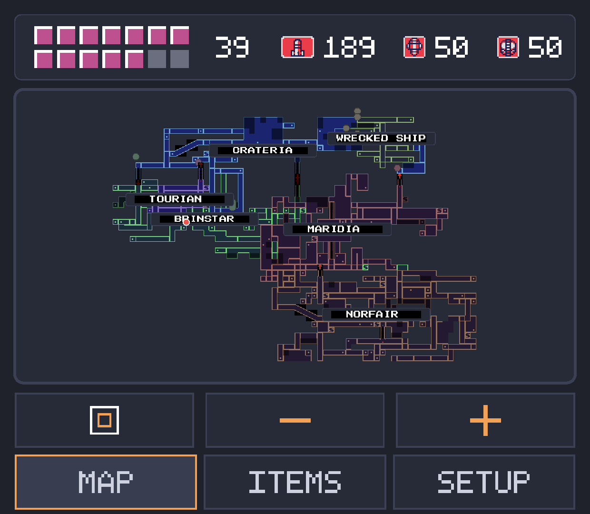
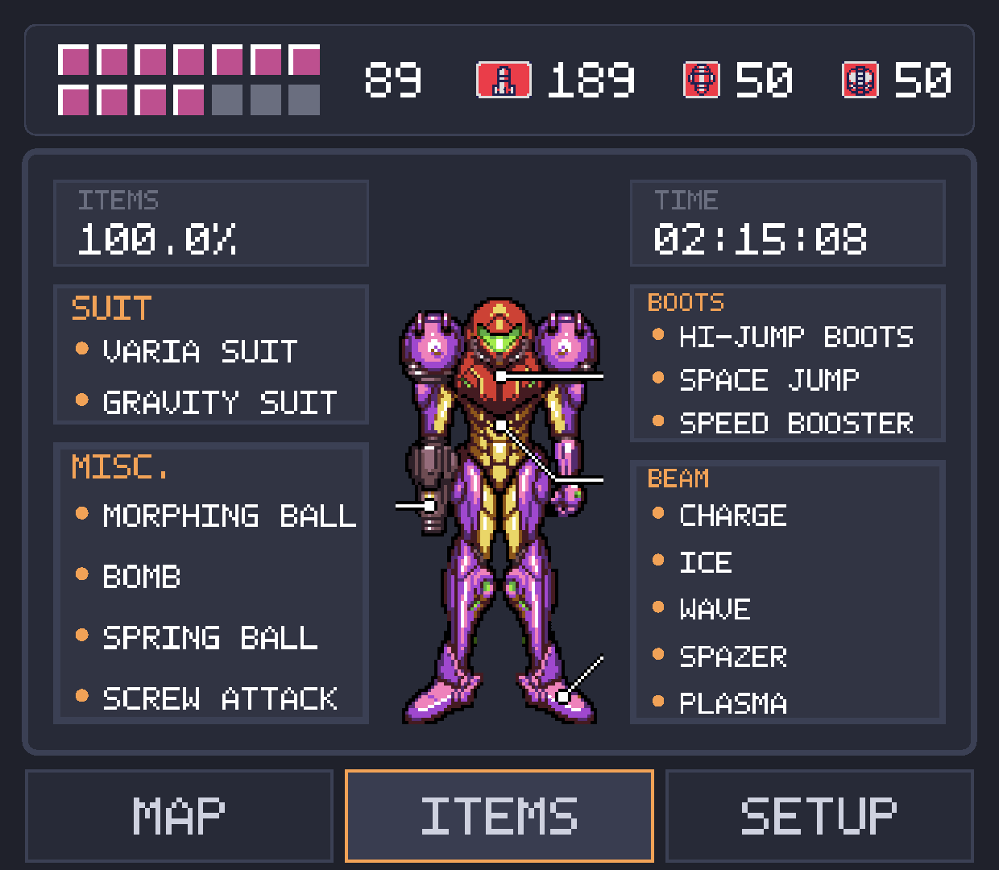
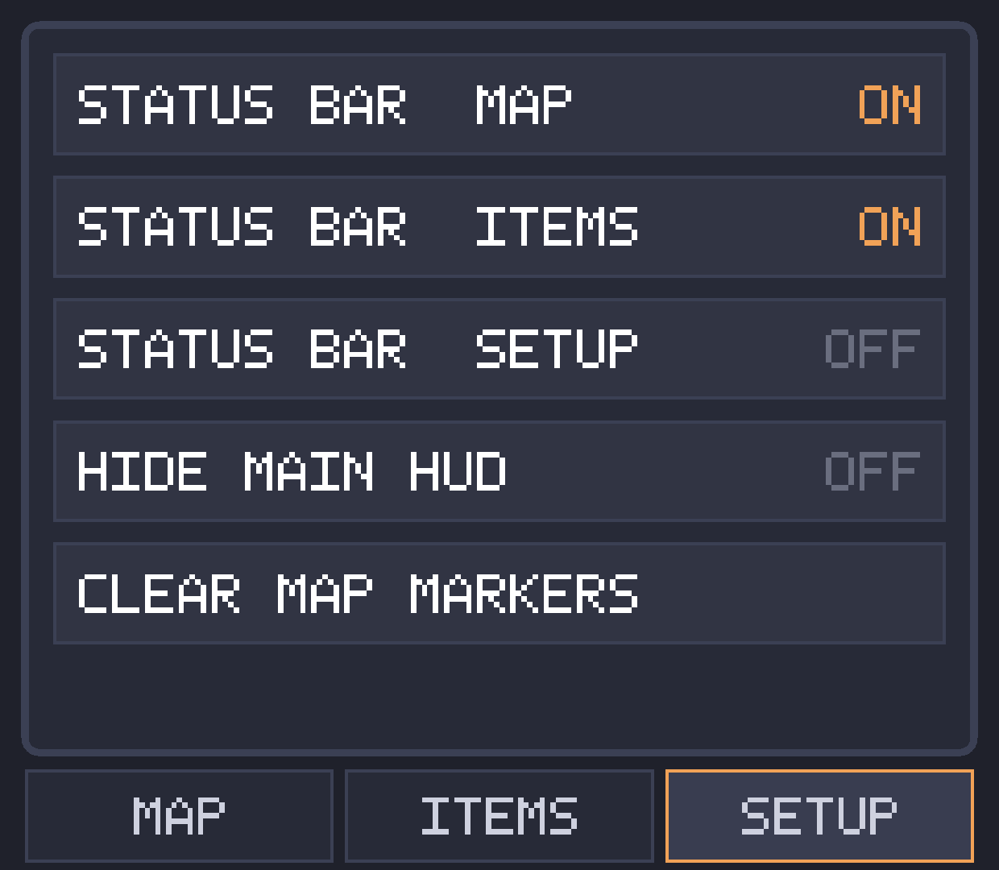

# MetroidArch

MetroidArch is a fork of RetroArch built for one thing: playing Super Metroid on a dual screen
Android handheld (built and tested on the AYN Thor) with real widescreen rendering on the main
screen and a live second screen showing your HP, ammo, map and item collection while you play.

This is not a general purpose RetroArch build. I stripped this down to focus entirely on Super
Metroid, so don't expect the usual "run any system" experience here. It installs alongside a
normal, unmodified RetroArch install (different package name, different app name) so you don't
lose your existing setup.

## Screenshots

| Main screen, widescreen | Second screen, not in gameplay |
|---|---|
|  |  |

The main screen renders in real widescreen (bsnes-hd beta only, see below). The second screen only
shows the live map/HP view while you're actually playing, it drops back to the logo the moment
you're in a menu, paused, or watching a cutscene.

| Second screen, room map | Second screen, world map |
|---|---|
|  |  |

The room map (left) tracks your current room live and tints to match whatever area you're in, with
the HP/ammo strip along the top, tap an icon there to arm it. The world map (right) shows every
area you've explored so far, with real area labels and door connectors between them.

| Second screen, items tab | Second screen, setup tab |
|---|---|
|  |  |

The items tab shows your full equipment list, item collection percentage, play time, and a suit
wireframe that changes with whatever you actually have equipped. The setup tab has a status bar
toggle for each of the three tabs, Hide Main HUD, and Clear Map Markers.

## What you need

This build only works properly with two specific, patched cores:

- **bsnes-hd beta core** - if you want real widescreen. This is the heavier option and needs more
  system resources, so it won't run at full speed on slower devices.
- **snes9x core** - if you don't care about widescreen and just want the second screen features on a
  normal 4:3 picture. Lighter on resources.

Both cores had to be patched by hand to expose the memory access and HUD control this app needs.
I bundled both patched cores directly into the APK, so a normal install already has what it
needs, you don't have to go find and build them yourself. If you ever run RetroArch's own Online
Updater afterward, it might overwrite one of these cores with the stock version, but the app
checks for that and quietly repairs itself the next time you open it.

If you want to look at what was actually changed in each core, here they are:

- bsnes-hd fork: https://github.com/Raekwon1603/bsnes-hd (branch `metroidarch-wram-access`)
- snes9x fork: https://github.com/Raekwon1603/snes9x (branch `metroidarch-wram-access`)

Both are real forks of the original projects, upstream credit below.

## Setting up widescreen (bsnes-hd beta)

If you want widescreen, you need to select the bsnes-hd beta core specifically. Here's the setup
for the widescreen patch itself, it's easy to get wrong if you haven't done it before:

You need a Japan/USA ROM of Super Metroid, and you don't patch the ROM itself, you add two extra
files next to it instead.

You need a specific version of Super Metroid: "Super Metroid (JU) [!] (UH).smc", with a CRC32 of
D63ED5F8. If you're not sure your ROM is the right one, check its CRC32 with an online tool and
compare. If it doesn't match, you'll need to track down the correct version elsewhere, I can't
provide ROMs.

Then grab the patch files from here:
https://forum.metroidconstruction.com/index.php/topic,5168.msg70656.html#msg70656

Download the BPS and BSO files. Once you have your ROM plus both patch files, all three need the
same base filename, just different extensions. For example:

```
Super Metroid Wide.smc
Super Metroid Wide.bps
Super Metroid Wide.bso
```

Put all three in your SNES ROM folder and load the game with the bsnes-hd beta core selected.
That's what actually turns on the widescreen rendering, the patch files alone don't do it.

Worth knowing before you go in: the widescreen rendering can have some visual glitches here and
there, mainly during big boss fights and cutscenes. It's not something I patched around, it comes
from the widescreen patch itself pushing bsnes-hd's HD mode past what it was really built for in
those specific scenes. Normal exploration and regular gameplay are fine.

If you'd rather skip all of this, just use the snes9x core with a normal Super Metroid ROM. You
get the whole second screen experience, just without widescreen, and it doesn't need any of the
extra patch files above.

## Super Metroid Redux

I've also tried this against [Super Metroid Redux](https://www.romhacking.net/hacks/4963/)
([GitHub](https://github.com/ShadowOne333/Super-Metroid-Redux)) by ShadowOne333, and everything I
tested worked correctly. Redux has its own dedicated widescreen
patch (also by ocesse), built specifically for the Redux v1.5 ROM, so don't use the vanilla
widescreen patch above with it, get the Redux one instead in the [romhacking.net](https://www.romhacking.net/hacks/4963/) download link and set it up the same way (matching
filenames for the .smc/.bps/.bso, same as above).

The map, HP strip, items tab, Hide Main HUD, map markers and the per tab status bar toggles all
worked normally in what I played. The one thing that doesn't work is tapping an ammo icon on the
second screen to arm it, Redux rebinds ammo switching to its own shoulder button controls
internally, so it doesn't go through the same memory address vanilla Super Metroid uses for that.
Not a big deal since you can just use the shoulder buttons like Redux intends.

I haven't played far enough into Redux to call this fully verified though, I don't plan on adding
proper dedicated Redux support since my main focus is vanilla Super Metroid, but if anyone wants
to play more of it and try the second screen features throughout, I'd be curious to hear how it
holds up. Open an issue if you run into anything.

## What the second screen actually does

The second screen shows the METROID logo while you're in a menu, cutscene or paused, and switches
to the live view the moment you're actually playing.

**Map tab** - your current room, zoomed and pannable, tinted to match the area you're in
(Crateria, Brinstar, Norfair, Wrecked Ship, Maridia, Tourian each get their own color). Tap the
button to switch to the full world map, showing every area you've explored so far with real area
labels and the doors connecting them. Pinch to zoom or use the on-screen buttons, drag to pan.
Long-press anywhere on the map to drop a marker (long-press it again to remove it), useful for
"come back here later" spots. Markers are saved per save file, so they won't follow you if you
switch to a different save slot or a different ROM.

**Items tab** - your full equipment list (suits, beams, boots, misc. items), your item collection
percentage, play time, and a full color wireframe of Samus that actually changes depending on
which suit you have equipped.

**Setup tab** - a status bar toggle for each of the three tabs (so you can show it on Map but hide
it on Items if you want more room, for example), a Hide Main HUD toggle that blanks out the HUD on
the main screen itself, and a Clear Map Markers option (needs a second tap to confirm, so you
don't wipe your markers by accident).

The HP/ammo strip at the top shows your energy, missiles, super missiles and power bombs live, and
you can tap directly on an ammo icon to arm or disarm it, same as pressing select in game. This
works from any tab now, not just the map.

I didn't touch save states or autosave-on-exit here on purpose. RetroArch already disables save
states under RetroAchievements hardcore mode, and turning that back on (or off) is your own call
to make in RetroArch's own menu, not something this app should override.

## A note on RetroAchievements

Everything described above is either read-only (map, HP, items) or purely cosmetic (Hide Main
HUD blanks the screen through the same DMA path the game itself would otherwise use to fill it, it
never touches any memory RetroAchievements cares about). None of it should conflict with hardcore
mode.

None of RetroArch's own RetroAchievements code was touched in this fork either. The `cheevos/`
folder and the `deps/rcheevos/` library it's built on are exactly the same as upstream, untouched.
I know "trust me" isn't worth much on its own, so rather than just claim it, here's the actual
full diff of everything I changed in each repo, compared straight against the real upstream
project. You can go through it yourself and see there's nothing in there touching achievements,
save states, or anything else that would raise a red flag. If you spot something I got wrong or
missed, please open an issue, I'd genuinely rather know.

- MetroidArch vs upstream RetroArch: https://github.com/libretro/RetroArch/compare/master...Raekwon1603:RetroArch:metroidarch-dual-screen
- bsnes-hd fork vs upstream bsnes-hd: https://github.com/DerKoun/bsnes-hd/compare/master...Raekwon1603:bsnes-hd:metroidarch-wram-access
- snes9x fork vs upstream snes9x: https://github.com/snes9xgit/snes9x/compare/master...Raekwon1603:snes9x:metroidarch-wram-access

## About the AI use

I'm honestly not that experienced with emulator internals or the RetroArch/core source code, so I
used Claude (Anthropic's AI) while building this, especially for figuring out where in
these massive codebases I actually needed to make changes, and for a lot of the real detective
work on the bsnes-hd and snes9x patches. I wanted to be upfront about that rather than pretend I
did all of this alone.

## Credit

This wouldn't exist without a lot of other people's work:

- [RetroArch](https://github.com/libretro/RetroArch) and the wider [libretro](https://www.libretro.com) project, this whole app is a fork of it.
- [bsnes-hd](https://github.com/DerKoun/bsnes-hd) for the widescreen/HD core this build depends on.
- [snes9x](https://github.com/snes9xgit/snes9x) for the lighter, non-widescreen core option.
- ocesse, for the Super Metroid widescreen patch (both the vanilla and Redux versions), from the
  [Metroid Construction forums](https://forum.metroidconstruction.com/index.php/topic,5168.msg70656.html#msg70656).
- ShadowOne333, for [Super Metroid Redux](https://www.romhacking.net/hacks/4963/)
  ([GitHub](https://github.com/ShadowOne333/Super-Metroid-Redux)), which this build also supports
  (see above).
- My own separate project, [super_metroid-android](https://github.com/Raekwon1603/super_metroid-android), a from-scratch native Super Metroid engine port I built earlier - the whole second screen design (map, HP strip, items tab, markers, settings) is based directly on what I already built there, just ported over to work as a RetroArch companion screen instead.

## The original RetroArch README

Since this is a fork, the original RetroArch project info, its own docs, support links and so on
still apply to the underlying frontend this is built on. You can find all of that on the real
[RetroArch repository](https://github.com/libretro/RetroArch).
